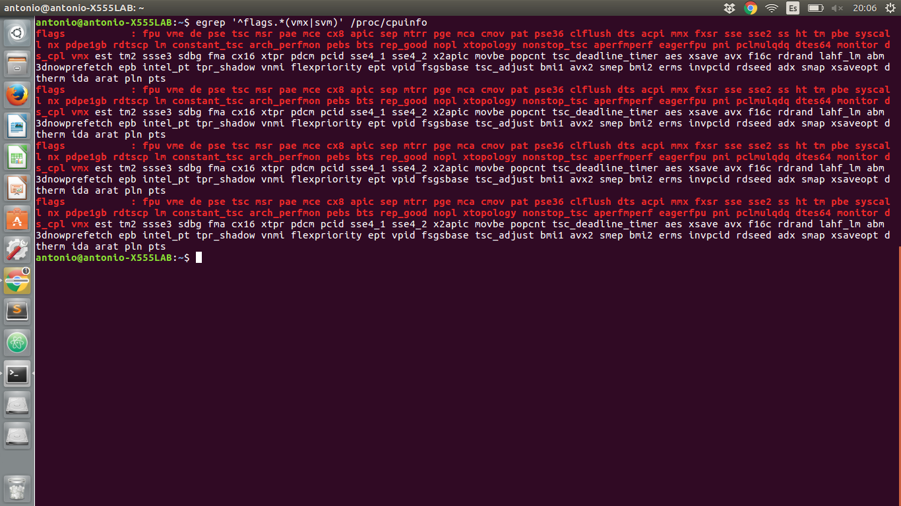
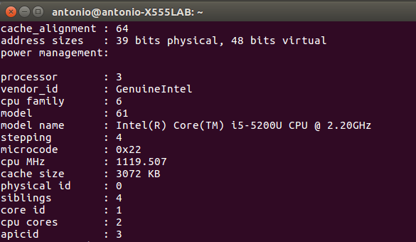

### Introducción a la infraestructura virtual: concepto y soporte físico ###

1. Consultar en el catálogo de alguna tienda de informática el precio de un ordenador tipo servidor y calcular su coste de amortización a cuatro y siete años. Consultar [este artículo en Infoautónomos sobre el tema](http://infoautonomos.eleconomista.es/consultas-a-la-comunidad/988/ ).
**Respuesta:** El servidor consultado --> [enlace](http://www.dynos.es/servidor-hp-proliant-ml30-gen9-e3-1220v5-3.0-ghz-4gb-ddr3-lff-1tb-dvd-rw-array-b140i--4514953942059__831067-425.html) tiene un precio de 744 euros.
  1. La amortización a cuatro años, se aplicar el 25% del precio total. Con la aplicación del 25% sobre el total (744 euros) comprado el 1 de enero del año 2017, su amortización sería:
    * 2017: 186 euros.
    * 2018: 186 euros.
    * 2019: 186 euros.
    * 2020: 186 euros.
  2. Para la amortización a siete años, los dos primeros años son un 25% y luego se va reduciendo:
    * 2017: 744 * 0,25 = 186 euros.
    * 2018: 744 * 0,25 = 186 euros.
    * 2019: 744 * 0,15 = 111,6 euros.
    * 2020: 744 * 0,15 = 111,6 euros.
    * 2021: 744 * 0,10 = 74,4 euros.
    * 2022: 744 * 0,05 = 37,2 euros.
    * 2023: 744 * 0,05 = 37,2 euros.
2. Usando las tablas de precios de servicios de alojamiento en Internet y de proveedores de servicios en la nube, Comparar el coste durante un año de un ordenador con un procesador estándar (escogerlo de forma que sea el mismo tipo de procesador en los dos vendedores) y con el resto de las características similares (tamaño de disco duro equivalente a transferencia de disco duro) en el caso de que la infraestructura comprada se usa sólo el 1% o el 10% del tiempo.
3. [¿Qué tipo de virtualización usarías en cada caso? Comentar en el foro.](https://github.com/JJ/IV16-17/issues/1 )
**Respuesta**:
  * **Virtualización plena**: la utilizo para para poder usar tanto windows como ubuntu al mismo tiempo. Por ejemplo necesito trabajar con windows y al mismo tiempo estoy trabajando en ubuntu, no quiero reiniciar el ordenador y acceder a windows instalado en mi ordenador de forma nativa a través del grub. Pues instalo una máquina virtual (VirtualBox) y en ella instalo Windows, así puedo trabajar con los dos SO a la vez.
  * **Virtualización parcial**: Es utilizado para compartir recurso/s con varios usuarios. Estos usuarios creen usar un recurso completo.
  * **Virtualización a nivel de sistema operativo**: también conocido como Virtualización basado en contenedores, es una opción ideal para los proveedores de alojamiento que necesitan una manera eficiente y segura para ofrecer sistemas operativos para que los clientes ejecuten sus servicios en ellos.
  * **Virtualización de aplicaciones**: Crea un entorno abstracto, haciendolo independiente del entorno físico. Por ejemplo cuando quiero usar una aplicación en Windows creada en Ubuntu.
  * **Virtualización de entornos de desarrollo**: Cuando creamos una aplicación o podemos comprobar un script, necisitamos comprobar si nuestro programa va a funcionar en varias distribuciones. Utilizamos esta virtualización para poder comprobar nuestro programa en varias distribuciones.
4. Crear un programa simple en cualquier lenguaje interpretado para Linux, empaquetarlo con CDE y probarlo en diferentes distribuciones.
5. Comprobar si el procesador o procesadores instalados tienen estos flags. ¿Qué modelo de procesador es? ¿Qué aparece como salida de esa orden?
**Respuesta**: Al insertar el siguiente comando
    egrep '^flags.*(vmx|svm)' /proc/cpuinfo
me aparece lo siguiente:

Para saber el modelo del procesador utilizamos el siguiente comando:
    cat /proc/cpuinfo

Como podemos observar mi procesador es **intel i5 5200U 2.20GHz**

6. Comprobar si el núcleo instalado en tu ordenador contiene este módulo del kernel usando la orden **kvm-ok**.
**Respuesta**: Podemos observar que el kernel de mi pc si contiene este módulo.

7. Instalar un hipervisor para gestionar máquinas virtuales, que más adelante se podrá usar en pruebas y ejercicios.
**Respuesta**: Para el hipervisor de máquinas virtuales he instalado [VirtualBox](https://www.virtualbox.org/) que si queremos instalarlo desde el terminal debemos de introducir el siguiente comando:
    sudo apt-get install virtualbox
