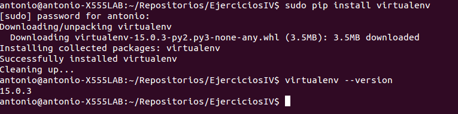
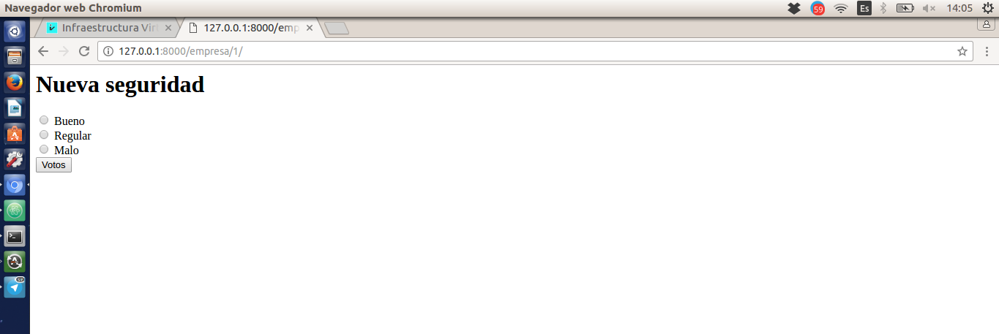

# Desarrollo basado en pruebas #

### 1. Instalar alguno de los entornos virtuales de node.js (o de cualquier otro lenguaje con el que se esté familiarizado) y, con ellos, instalar la última versión existente, la versión minor más actual de la 4.x y lo mismo para la 0.11 o alguna impar (de desarrollo). ###
El entorno virtual que he instalado ha sido **virtualenv** de Python. Como guía de instalación he usado este [enlace](http://rukbottoland.com/blog/tutorial-de-python-virtualenv/) (como se puede apreciar es muy sencillo instalar el entorno).

Insertamos el siguiente comando:

    pip install virtualenv

Y posteriormente para ver que lo tenemos instalado:

    virtualenv --version

### 2. Como ejercicio, algo ligeramente diferente: una web para calificar las empresas en las que hacen prácticas los alumnos. Las acciones serían: Crear empresa, Listar calificaciones para cada empresa, crear calificación y añadirla (comprobando que la persona no la haya añadido ya), borrar calificación (si se arrepiente o te denuncia la empresa o algo), Hacer un ránking de empresas por calificación, por ejemplo, Crear un repositorio en GitHub para la librería y crear un pequeño programa que use algunas de sus funcionalidades. Si se quiere hacer con cualquier otra aplicación, también es válido. Se trata de hacer una aplicación simple que se pueda hacer rápidamente con un generador de aplicaciones como los que incluyen diferentes marcos MVC. Si cuesta mucho trabajo, simplemente prepara una aplicación que puedas usar más adelante en el resto de los ejercicios. ###

[Repositorio del ejercicio](https://github.com/Antkk10/IVWebCalificarEmpresas)

Aquí podemos observar que podemos introducir una valoración sobre la empresa "Nuevas tecnologías".

