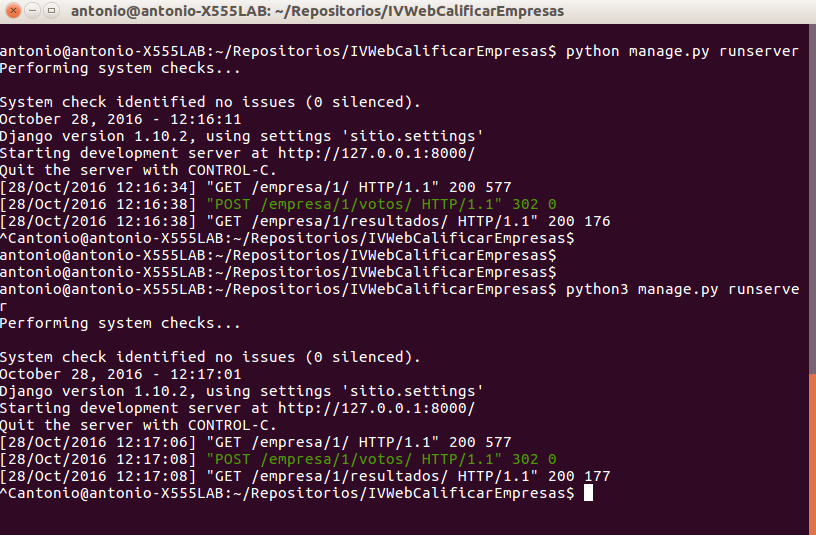
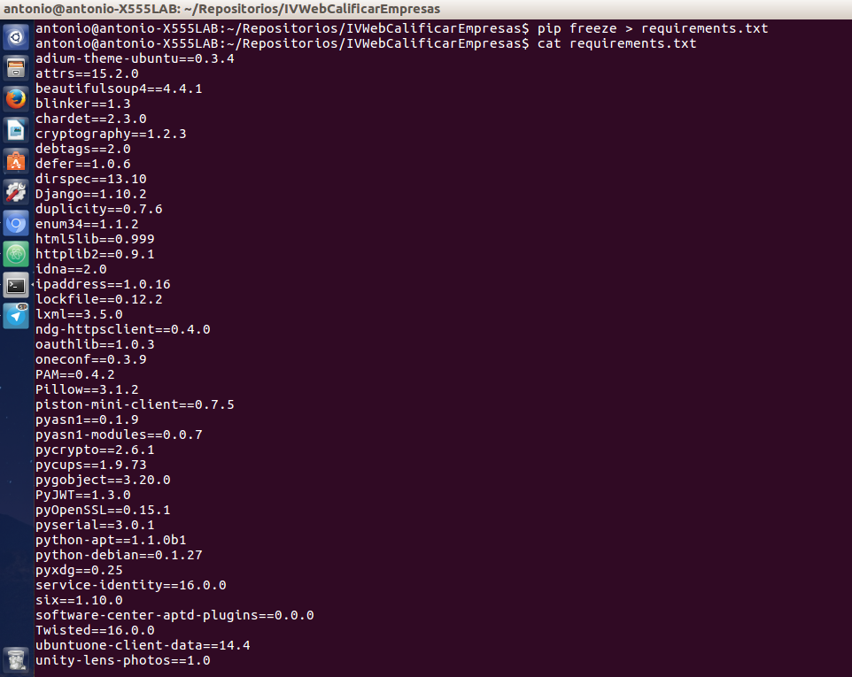
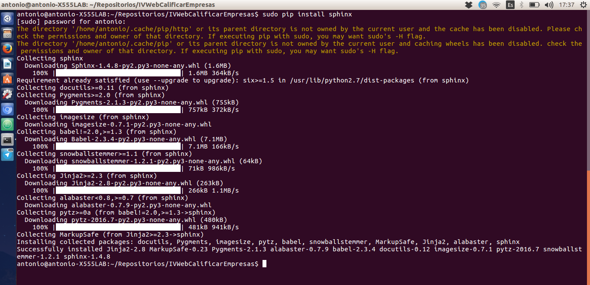
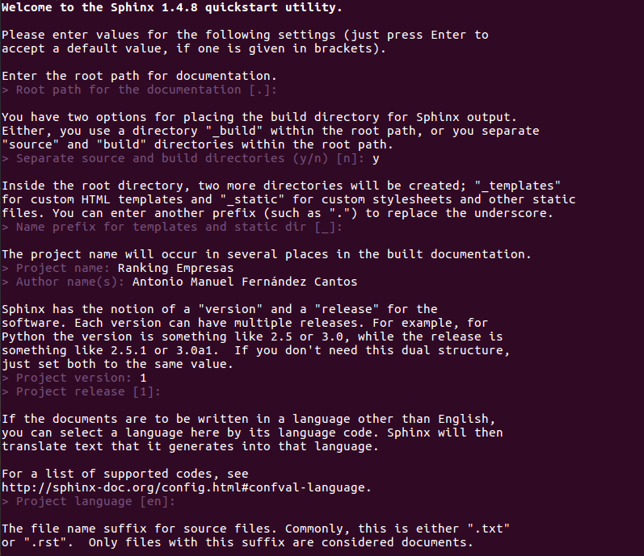
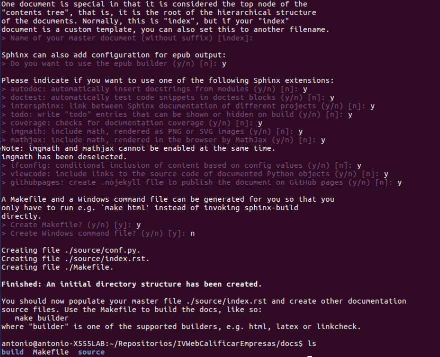
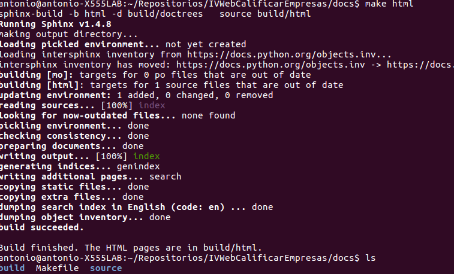
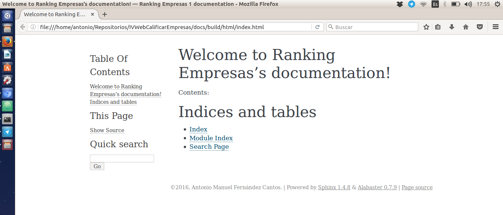
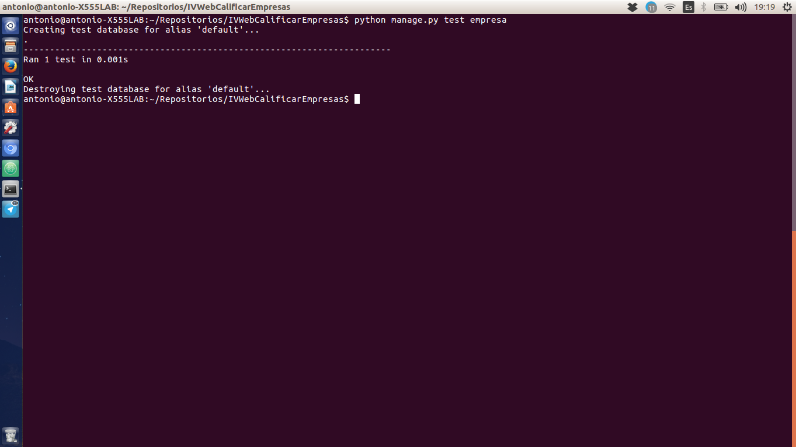
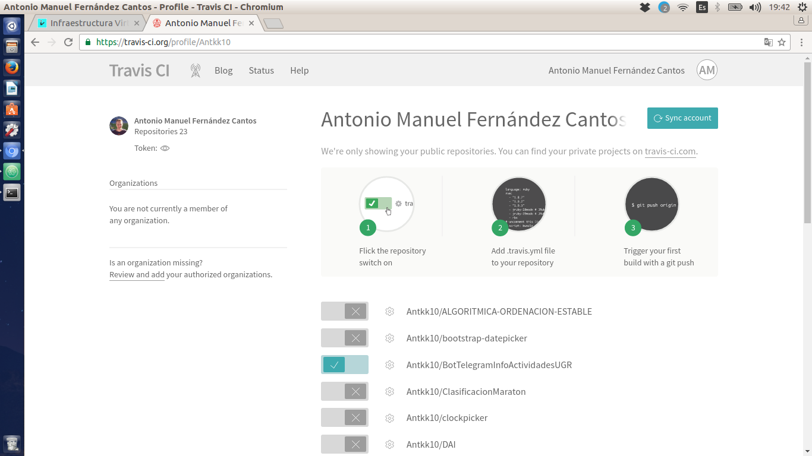
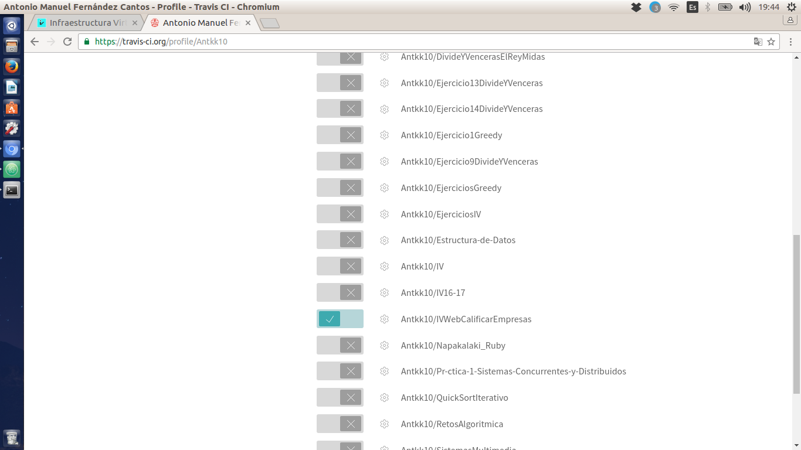

# Desarrollo basado en pruebas #

### 1. Instalar alguno de los entornos virtuales de node.js (o de cualquier otro lenguaje con el que se esté familiarizado) y, con ellos, instalar la última versión existente, la versión minor más actual de la 4.x y lo mismo para la 0.11 o alguna impar (de desarrollo). ###
El entorno virtual que he instalado ha sido **virtualenv** de Python. Como guía de instalación he usado este [enlace](http://rukbottoland.com/blog/tutorial-de-python-virtualenv/) (como se puede apreciar es muy sencillo instalar el entorno).

Insertamos el siguiente comando:

    pip install virtualenv

Y posteriormente para ver que lo tenemos instalado:

    virtualenv --version

### 2. Como ejercicio, algo ligeramente diferente: una web para calificar las empresas en las que hacen prácticas los alumnos. Las acciones serían: Crear empresa, Listar calificaciones para cada empresa, crear calificación y añadirla (comprobando que la persona no la haya añadido ya), borrar calificación (si se arrepiente o te denuncia la empresa o algo), Hacer un ránking de empresas por calificación, por ejemplo, Crear un repositorio en GitHub para la librería y crear un pequeño programa que use algunas de sus funcionalidades. Si se quiere hacer con cualquier otra aplicación, también es válido. Se trata de hacer una aplicación simple que se pueda hacer rápidamente con un generador de aplicaciones como los que incluyen diferentes marcos MVC. Si cuesta mucho trabajo, simplemente prepara una aplicación que puedas usar más adelante en el resto de los ejercicios. ###

[Repositorio del ejercicio](https://github.com/Antkk10/IVWebCalificarEmpresas)

Aquí podemos observar que podemos introducir una valoración sobre la empresa "Nuevas seguridad".

### 3. Ejecutar el programa en diferentes versiones del lenguaje. ¿Funciona en todas ellas? ###

Para la versión 2.7 y 3.5 funciona perfectamente.

### 4. Crear una descripción del módulo usando package.json. En caso de que se trate de otro lenguaje, usar el método correspondiente. ###
El lenguaje que estoy usando es python, entonces para obtener todas las dependencias que utiliza mi programa vamos a usar el comando pip freeze y todo el contenido lo va a volcar a un archivo de texto llamado requirements.txt.

    pip freeze > requirements.txt

### 5. Automatizar con grunt, gulp u otra herramienta de gestión de tareas en Node la generación de documentación de la librería que se cree usando docco u otro sistema similar de generación de documentatión. . Previamente, por supuesto, habrá que documentar tal librería. ###

Uso de Sphinx para generar la documentación html del proyecto. Primero debemos de instalar Sphinx:

    pip install sphinx

He tenido que instalarlo con sudo ya que al instalarlo en algunas carpetas mostrava excepciones.

Posteriormente introducimos en consola

    sphinx-quickstart

Y podemos comprobar que se obtiene la documentación correctamente:

Para obtener la documentación insertamos el siguiente comando:

    make html

Indicando html le estamos diciendo que nos genere la documentación para visualizarla en página web.

Para acceder a la documentación es en la carpeta **docs/build/html**

### 6. Para la aplicación que se está haciendo, escribir una serie de aserciones y probar que efectivamente no fallan. Añadir tests para una nueva funcionalidad, probar que falla y escribir el código para que no lo haga (vamos, lo que viene siendo TDD). ###
He creado la página web con el framework Django. Al utilizar Django, crea automáticamente el archivo **tests.py**. Voy a modificarlo para realizar una serie de test sobre el código generado.
Este es mi test [archivo test.py](https://github.com/Antkk10/IVWebCalificarEmpresas/blob/master/empresa/tests.py). En la siguiente imagen podemos observar que pasa el test

### 7. Convertir los tests unitarios anteriores con assert a programas de test y ejecutarlos desde mocha, usando descripciones del test y del grupo de test de forma correcta. Si hasta ahora no has subido el código que has venido realizando a GitHub, es el momento de hacerlo, porque lo vas a necesitar un poco más adelante. ###

Django proporciona un método propio para realizar los test.

    python manage.py test empresa

Obtenemos la misma salida que en el ejercicios 6.

### Ejercicio 8. ###

#### Darse de alta. Muchos están conectados con GitHub por lo que puedes autentificarte directamente desde ahí. A través de un proceso de autorización, puedes acceder al contenido e incluso informar del resultado de los tests a GitHub. ####

#### Activar el repositorio en el que se vaya a aplicar la integración continua. Travis permite hacerlo directamente desde tu configuración; en otros se dan de alta desde la web de GitHub. ####

#### Crear un fichero de configuración para que se ejecute la integración y añadirlo al repositorio. ####

[archivo travis](https://github.com/Antkk10/IVWebCalificarEmpresas/blob/master/.travis.yml)

PD: Puede ser que no funcione ya que hice una instalación con sudo (mal hecho por mi parte) y no me pasa el test, de hecho en la página de travis menciona que debo usar sudo.
