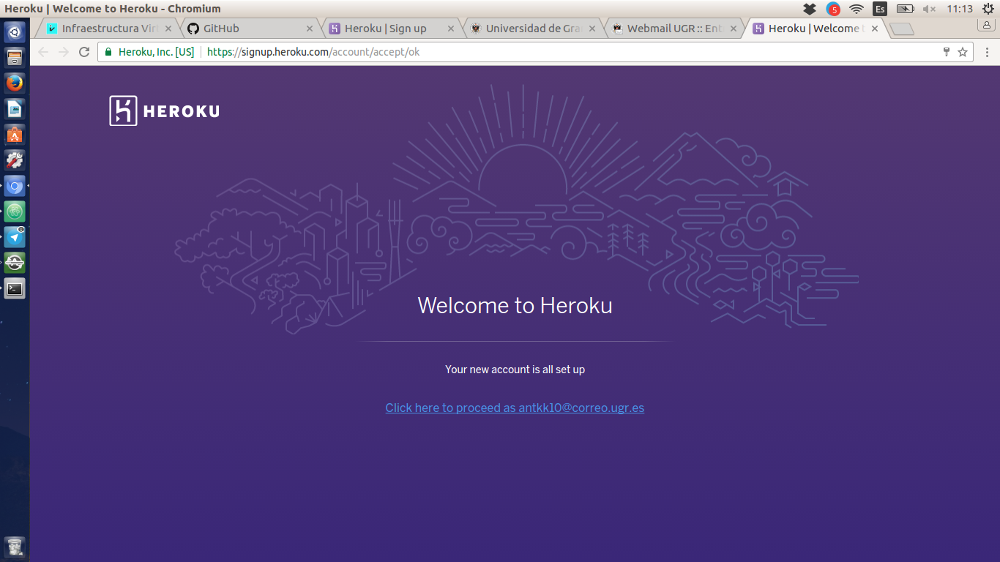
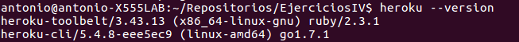
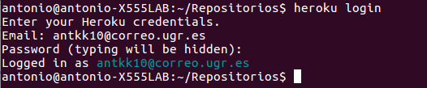
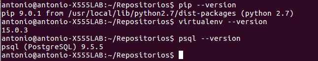
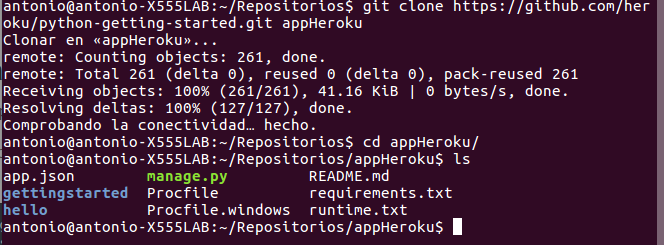
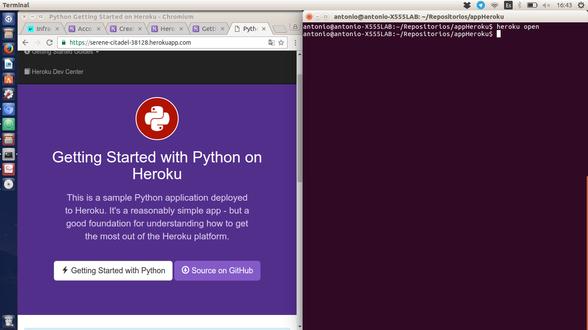
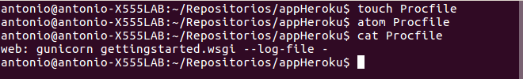
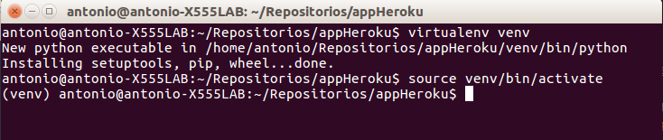
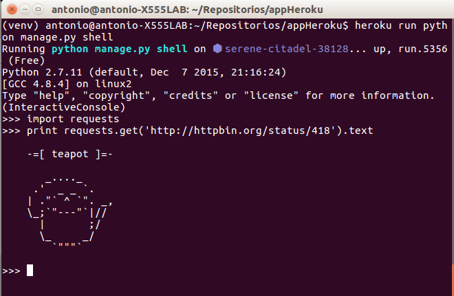
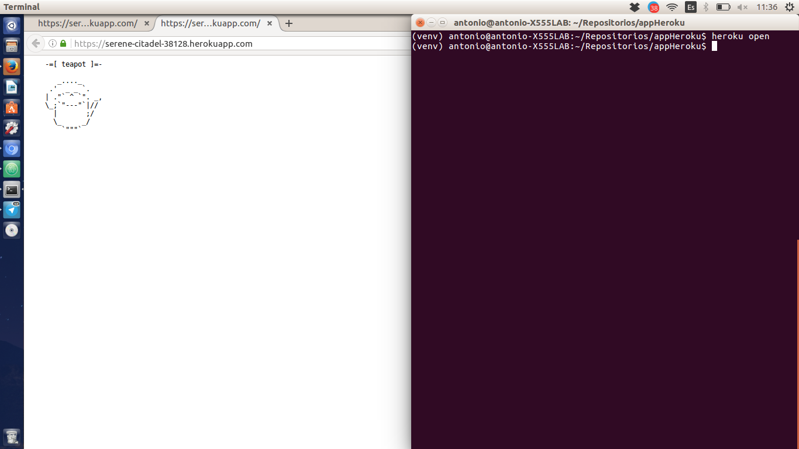

# Ejercicios hito 3 #

### 1. Darse de alta en algún servicio PaaS tal como Heroku, Nodejitsu, BlueMix u OpenShift ###
Me he dado de alta en Heroku con la cuenta de la universidad.

### Ejercicio 2 y 5 ###
El PaaS que he usado ha sido [Heroku](https://dashboard.heroku.com/apps)

El primer paso ha sido crear una cuenta en la página web. Para instalar heroku en el terminal debemos de tener instalado **Ruby**. El comando para instalar **heroku** es:
    wget -O- https://toolbelt.heroku.com/install-ubuntu.sh | sh

Podemos comprobar la versión de **heroku** con el siguiente comando:

    heroku --version

El segundo paso es loguearnos en heroku a través del terminal:

    heroku login

Para la creación de la aplicación debemos de tener instalado **pip**, **virtualenv** y **postgres**

Clonamos el repositorio en local.

Creamos la aplicación en **Heroku**
    heroku create

Para despegar el código insertamos el siguiente comando:
    git push heroku master

Nos aseguramos de que una instancia de la app está ejecutandose con el comando:
    heroku ps:scale web=1

Para abrir la página web usamos el siguiente comando:
    heroku open

Para ejecutar la aplicación debemos de crear un archivo **Procfile**, y dentro insertar esta única linea (por defecto la inserta automáticamente al hacer **touch Procfile**).

Para ver los dynos (máquinas virtuales de heroku) ejecutandose podemos usar el siguiente comando:

    heroku ps

que en nuestro caso tenemos una dyno ejecutandose.
El siguiente paso es crear el entorno virtual para la aplicación de forma local, que lo llamamos **venv**.

    virtualenv venv

Lo activamos con el comando

    source venv/bin/activate

Instalamos en el entorno virtual los requisitos del sistema con el siguiente comando:

    pip install -r requirements.txt

En un primer momento al insertar el comando nos salta un error solicitando otra instalación (postgresql-server-dev-X.Y):

Lo instalamos y posteriormente volvemos a insertar el comando de requistos. Podemos comprobar que todo se instala correctamente:

Despúes de comprobar que se ha instalado correctamente y ver que funciona de forma local, he añadidod al fichero requirements la linea **requests==2.9.1** y **imrt requests** al fichero **hello/views.py**. Esto lo hacemos para que se pueda leer las peticiones web en la cabecera.
Para almacenar todos los cambios metemos los tres siguientes comandos:

    git add .
    git commit -m "Probando app heroku"
    git push heroku master

Vamos a ejecutar y acceder a la máquina virtual con el siguiente comando:

    heroku run python manage.py shell

En el terminal de dyno (nuestra máquina virtual) insertamos estos dos comandos

    import requests
    print requiests.get('http://httpbin.org/status/418').text

El siguiente paso es definir configuraciones de variables. Para ello abrimos **hello/views.py** y añadimos las siguientes lineas:

    import os

    def index(request):
        times = int(os.environ.get('TIMES',3))
        return HttpResponse('Hello! ' * times)

Para añadir a la configuración una variable usamos:

    heroku config:set TIMES=4

Y para ver la configuración de variables insertamos:

    heroku config

Para ver la aplicación desplegada insertamos en el terminal.

    heroku open

Para cerrar la aplicación:

    heroku ps:scale web=0

### Ejercicio 3 ###
He creado una aplicación con Flask en la cual se introduce un usuario por consola y se le da la bienvenida.
En caso de que se introduzca una url erronea, manda un mensaje 404. El código es el siguiente:

    from flask import Flask

    app = Flask(__name__)
    #
    def CodigoHTML(username):
         return  """
                    <html>
                        <head>
                            <title>Página de bienvenida</title>
                            
                        </head>
                        <body>
                            <h1>Bienvenido """ + username + """</h1>
                        </body>
                    </html>
                """

    # Da la bienvenida a un usuario en concreto.
    @app.route('/user/<username>')
    def MostrarUsuario(username):
        # Convertimos a string, en caso dde no hacerlo da error.
        return CodigoHTML(str(username))

    # Función que es invocada cuando la página no existe.
    @app.errorhandler(404)
    def PageNotFound(error):
        return "Página no encontrada", 404

    if __name__ == '__main__':
        app.run(host='0.0.0.0', debug=True)  # 0.0.0.0 para permitir conexiones
                                             #         desde cualquier sitio.
                                             #         Ojo, peligroso en solo
                                             #         en modo debug
