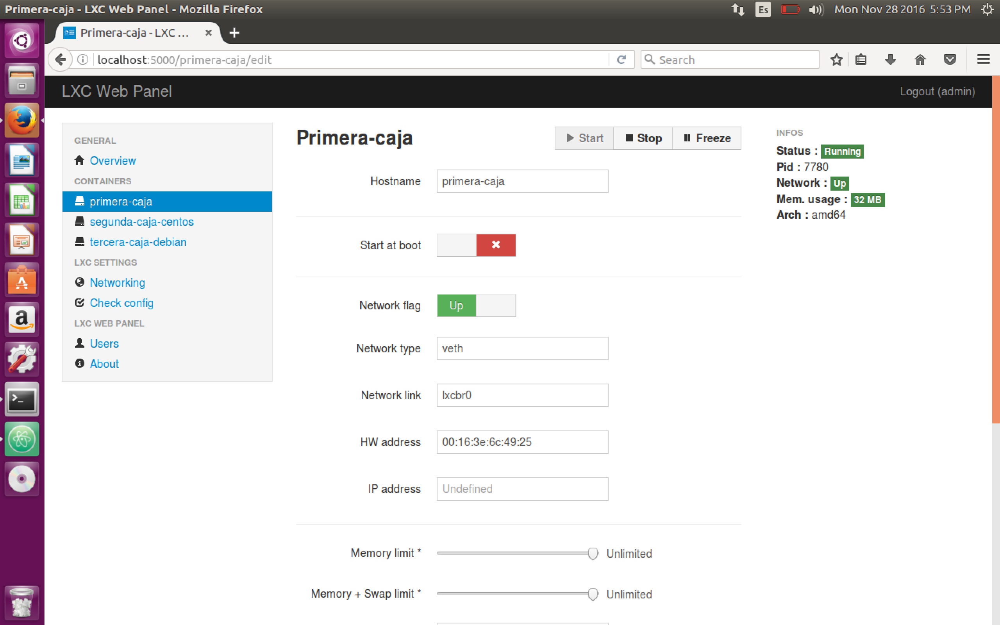

# Ejercicios hito 4 #

### Ejercicio 1: Instala LXC en tu versión de Linux favorita. Normalmente la versión en desarrollo, disponible tanto en GitHub como en el sitio web está bastante más avanzada; para evitar problemas sobre todo con las herramientas que vamos a ver más adelante, conviene que te instales la última versión y si es posible una igual o mayor a la 1.0. ###

He instalado la versión 2.0.5 de **LXC**

### Ejercicio 2: Comprobar qué interfaces puente se han creado y explicarlos. ###

Para comprobar las interfaces primero arrancamos la máquina y accedemos a ella.

Para ver las interfaces usamos el comando:

    ifconfig -a

eth0 (Ethernet) es la interfaz de red. Es utilizada para tener acceso a internet.

La segunda interfaz es lo (loopack) y sirve para comunicarse con nuestro sistema y los demás contenedores.

### Ejercicio 3: ###

#### 1. Crear y ejecutar un contenedor basado en Debian. ####

Para instalar debian en el contenedor:

    sudo lxc-create -t debian -n tercera-caja-debian

#### 2. Crear y ejecutar un contenedor basado en otra distribución, tal como Fedora. Nota En general, crear un contenedor basado en tu distribución y otro basado en otra que no sea la tuya. Fedora, al parecer, tiene problemas si estás en Ubuntu 13.04 o superior, así que en tal caso usa cualquier otra distro. Por ejemplo, Óscar Zafra ha logrado instalar Gentoo usando un script descargado desde su sitio, como indica en este comentario en el issue. ####

He instalado centos, para ello primeros instalamos **yum**

    sudo apt-get install -y yum

Creamos el contenedor:

    sudo lxc-create -t centos -n segunda-caja-centos

Para establecer la contraseña debemos de introducir este comando:

    sudo chroot /var/lib/lxc/caja_centos/rootfs passwd

Por último iniciamos el contenedor y accedemos a el:

    sudo lxc-start -n segunda-caja-centos
    sudo lxc-console -n segunda-caja-centos

### Ejercicio 4: ###

#### 1. Instalar lxc-webpanel y usarlo para arrancar, parar y visualizar las máquinas virtuales que se tengan instaladas. ####
Para instalar lxc-webpanel insertamos este comando en el terminal:

    wget https://lxc-webpanel.github.io/tools/install.sh -O - | bash

Para acceder a lxc-webpanel introducimos **localhost:5000** en nuestro navegador. El nombre de usuario es **admin** y la contraseña **admin**

Como podemos observar en el panel de la primera caja, tenemos este contenedor en estado **stop**.

Podemos ponerlo en ejecución pulsando el botón **start**

#### 2. Desde el panel restringir los recursos que pueden usar: CPU shares, CPUs que se pueden usar (en sistemas multinúcleo) o cantidad de memoria. ####

He cambiado el límite de memoria a 512 MB y CPUs a 1. Para ello primero debemos de parar el contenedor pulsando el botón stop. Después rellenamos los campos y pulsamos el botón apply.

### Ejercicio 5: Comparar las prestaciones de un servidor web en una jaula y el mismo servidor en un contenedor. Usar nginx. ###

Error al intentar instalar la jaula.

### Ejercicio 6: instalar dockers. ###

Para instalar Dockers he seguido este [enlace](https://docs.docker.com/engine/installation/linux/ubuntulinux/). Comandos:

    sudo apt-get update
    sudo apt-get install apt-transport-https ca-certificates
    sudo apt-key adv \
               --keyserver hkp://ha.pool.sks-keyservers.net:80 \
               --recv-keys 58118E89F3A912897C070ADBF76221572C52609D
    sudo apt-add-repository 'deb https://apt.dockerproject.org/repo ubuntu-xenial main'
    sudo apt-get update
    apt-cache policy docker-engine
    sudo apt-get install -y docker-engine

Para comprobar si hemos instalado correctamente docker:

    sudo systemctl status docker

### Ejercicio 7: ###

#### 1. Instalar a partir de docker una imagen alternativa de Ubuntu y alguna adicional, por ejemplo de CentOS. ####
Para instalar ubuntu:

    sudo docker pull ubuntu

Para instalar CentOS:

    sudo docker pull centos

#### 2. Buscar e instalar una imagen que incluya MongoDB. ####

Para instalar una imagen que incluya MongoDB:

    sudo docker pull mongo

Podemos ver los tapers que tenemos instalado con:

    sudo docker images

### Ejercicio 8: Crear un usuario propio e instalar nginx en el contenedor creado de esta forma. ###

Arrancamos el taper con ubuntu y accedemos al terminal:

    sudo docker run -i -t ubuntu /bin/bash

Creamos el usuario con contraseña:

    adduser usuariodocker

El usuario se llama:

    login: usuariodocker
    pw: usuariodocker

He tenido un problema con sudo (no me dejaba usar el comando, no lo encuentra). Para poder solucionar el error, antes de añadir el usuario al grupo sudo y acceder a la cuenta, debemos instalar sudo desde root (estamos actualmente en root):

    apt-get update
    apt-get -y install sudo

Añadimos al grupo al nuevo usuario al grupo de superusuarios:

    adduser usuariodocker sudo

Para acceder a la cuenta:

    login usuariodocker

Introducimos la clave.

Ahora hay que instalar **nginx** y arrancarlo.

    sudo apt-get install -y nginx
    sudo service nginx start

Instalamos curl para ver si funciona nginx:

    sudo apt-get install -y curl

Para ver su funciona nginx:

    curl localhost

### Ejercicio 9: Crear a partir del contenedor anterior una imagen persistente con commit. ###

Primero debemos obtener la id de la columna CONTAINER ID:

    sudo docker ps -a

Congemos la id que queremos y la inspeccionamos para obtener la id larga

    sudo docker inspect 3bab2b96d02b

Obtenemos la id larga, después toca hacer el commit:

    sudo docker commit 3bab2b96d02bd45e845ee6eb76fd0233d2a7f701099b9e69a4b793693080e620 ejercicio9

Vemos el resultado con

    sudo docker images

### Ejercicio 10: Crear una imagen con las herramientas necesarias para el proyecto de la asignatura sobre un sistema operativo de tu elección. ###

[Enlace ejercicio 10](https://github.com/Antkk10/BotTelegramInfoActividadesUGR/blob/Documentacion/documentacionhito4.md)
