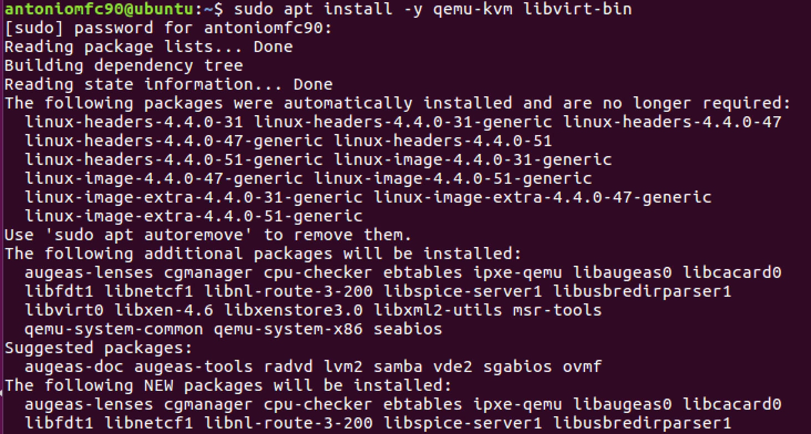
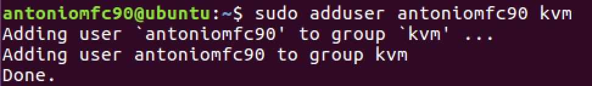
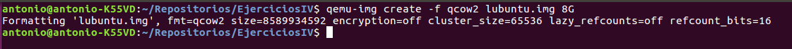
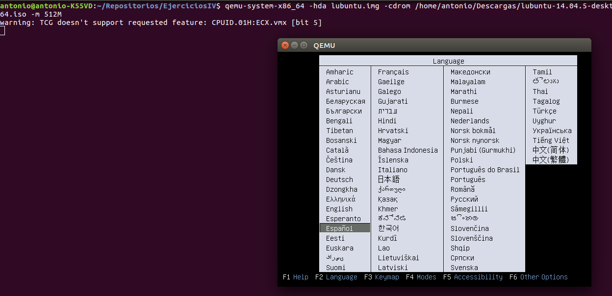
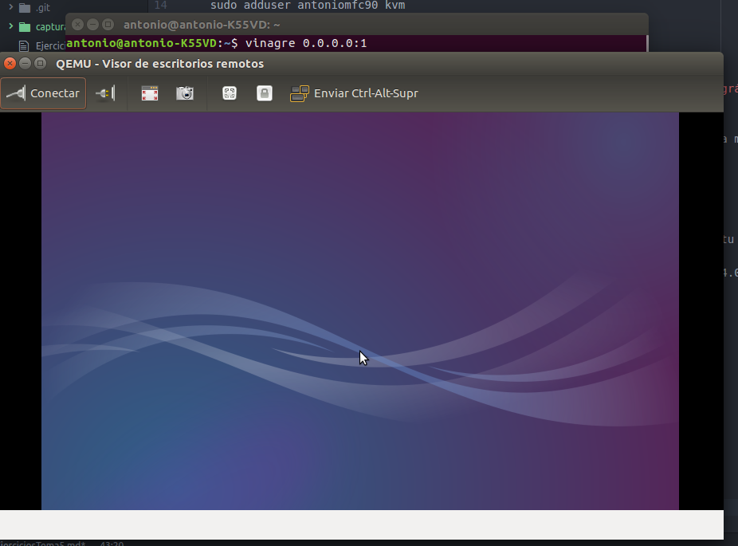
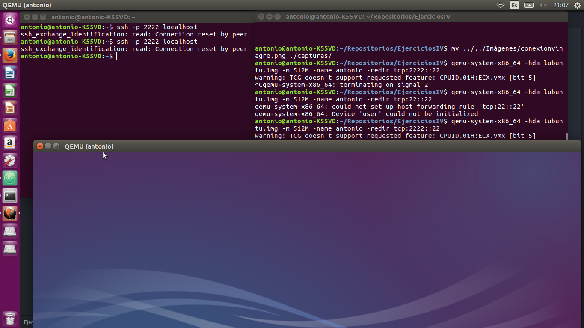
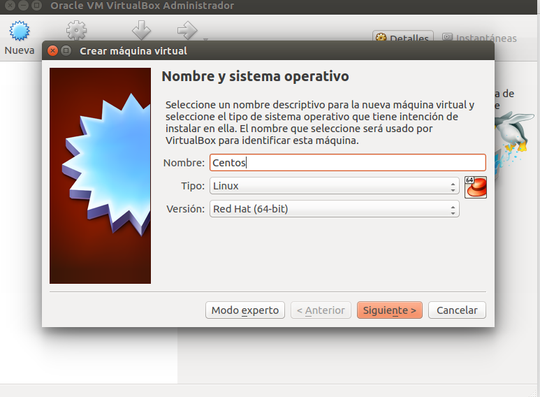
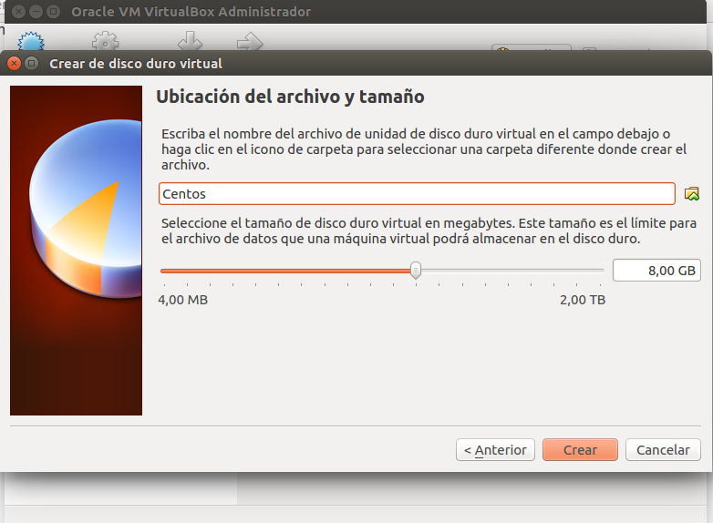
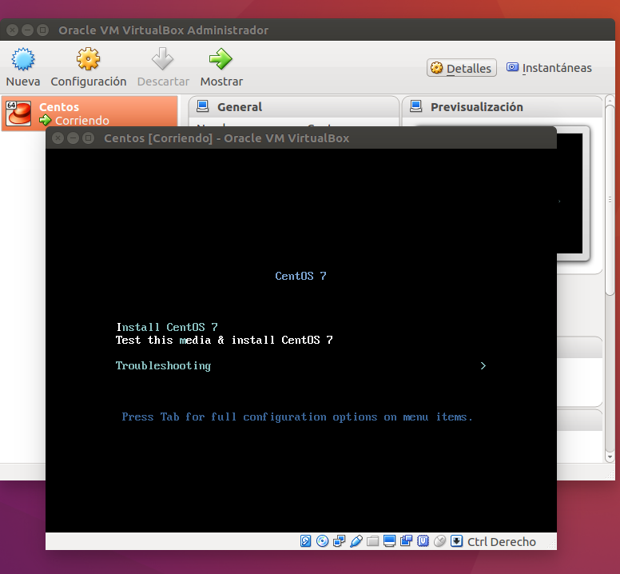

# Ejercicios Tema 5 #

### Ejercicio 1: Instalar los paquetes necesarios para usar KVM. Se pueden seguir estas instrucciones. Ya lo hicimos en el primer tema, pero volver a comprobar si nuestro sistema está preparado para ejecutarlo o hay que conformarse con la paravirtualización. ###

Vamos a probar a instalar kvm por si en este tiempo he formateado la máquina virtual donde tengo instalado Ubuntu. En primer lugar utilizamos el comando:

    sudo apt install -y qemu-kvm libvirt-bin

A continuación podemos añadir usuarios al grupo de kvm para poder crear máquinas virtuales.

    sudo adduser antoniomfc90 kvm

### Ejercicio 4: Crear una máquina virtual Linux con 512 megas de RAM y entorno gráfico LXDE a la que se pueda acceder mediante VNC y ssh. ###

He instalado el SO lubuntu. Primero tenemos que indicar el espacio de disco de la máquina con

    qemu-img create -f qcow2 lubuntu.img 8G

Instalamos la máquina virtual con el SO (antes tenemos que bajar la iso de lubuntu de la página oficial)

    qemu-system-x86_64 -hda lubuntu.img -cdrom /home/antonio/Descargas/lubuntu-14.04.5-desktop-amd64.iso -m 512M

Para conectar por vnc he usado vinagre. Primero lo instalamos con

    sudo apt install -y vinagre

Para conectar por vnc necesitamos activarlo

    qemu-system-x86_64 -vnc 0.0.0.0:1 -hda lubuntu.img

Nos conectamos con vinagre con

    vinagre 0.0.0.1

Activamos la opción para ssh

    qemu-system-x86_64 -hda lubuntu.img -m 512M -name antonio -redir tcp:2222::22

Accedemos por ssh

    ssh -p 2222 localhost

En teoría debería acceder, sin embargo aparece este error:

### Ejercicio 6: Instalar una máquina virtual con Linux Mint para el hipervisor que tengas instalado.###

He instalado CentOS en VirtualBox, primero reservamos el tamaño de disco duro y el uso de memoria RAM.

Procedemos a instalar

