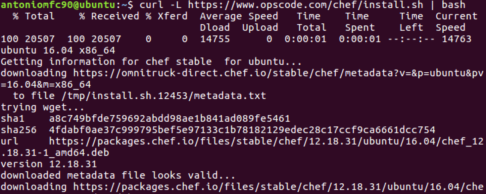
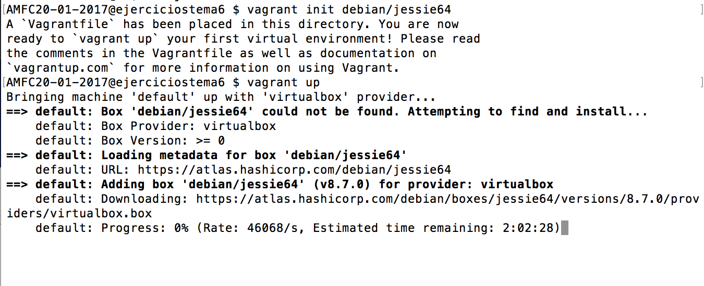

# Ejercicios tema 6 #

### Ejercicio 1: Instalar chef en la máquina virtual que vayamos a usar ###

Instalamos **chef** con este comando:

    curl -L https://www.opscode.com/chef/install.sh | bash

### Ejercicio 4: Instalar una máquina virtual Debian usando Vagrant y conectar con ella. ###

Instalamos debian usando una imagen subida en Vagrant. Utilizamos

    vagrant init debian/jessie64
    vagrant up

