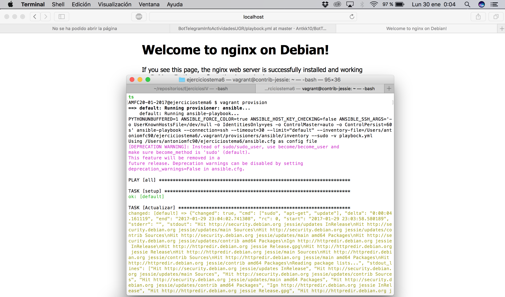

# Ejercicios tema 6 #

### Ejercicio 1: Instalar chef en la máquina virtual que vayamos a usar ###

Instalamos **chef** con este comando:

    curl -L https://www.opscode.com/chef/install.sh | bash

### Ejercicio 4: Instalar una máquina virtual Debian usando Vagrant y conectar con ella. ###

Instalamos debian usando una imagen subida en Vagrant. Utilizamos

    vagrant init debian/jessie64
    vagrant up

### Ejercicio 5: Crear un script para aprovisionar nginx o cualquier otro servidor web que pueda ser útil para alguna otra práctica. ###

Para poder aprovisionar modificamos el Vagrantfile añadiendo:

    #Provisionamiento
    config.vm.provision "ansible" do |ansible|
          ansible.sudo = true
          ansible.playbook = "playbock.yml"
          ansible.verbose = "v"
          ansible.host_key_checking = false
    end

Después creamos el archivo playbock.yml que es el que usa ansible

    - hosts: all
      sudo: yes
      remote_user: vagrant
      tasks:
      - name: Actualizar
        command: sudo apt-get update
      - name: Instalar nginx
        apt: name=nginx state=present

Creamos el archivo ansible.cfg para evitar los errores.

    [defaults]
    host_key_checking = False
    [ssh_connection]
    control_path=%(directory)s/%%h-%%r

Por último añadimos en Vagrantfile el puerto de escucha:

    config.vm.network "forwarded_port", guest: 80, host: 8080

Para comprobar que el servicio funciona, primero levantamos la máquina con

    vagrant up

Después

    vagrant provision

Podemos ver el uso de nginx poniendo en el navegador:

    http://localhost:8080

